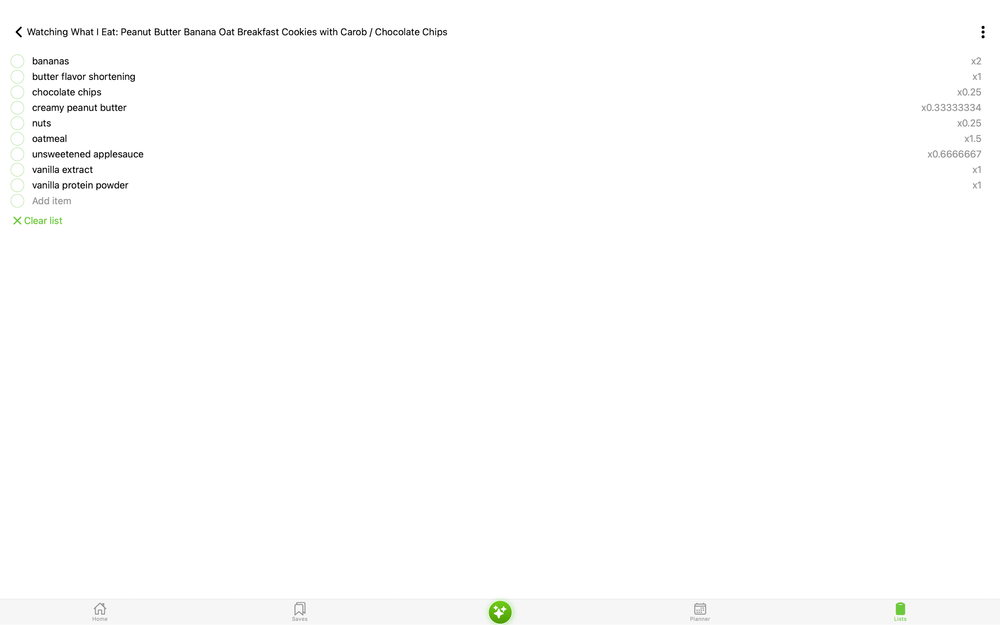

# Competitor Analysis: [System Name] 
## General Information 
- **Name of System:** [Cookpanion] 
- **Company/Developer:** [Christine Fosco] 
- **Website/Product Page:** [(https://cookpanion.net)] 
- **Version/Release Date:** [Version 2.0.1 em MacOs] 
- **Platform(s) Supported:** [Aplicações móveis (iOS, Android), MacOS e Web] 
- **Target Audience:** [Utilizadores interessados em culinária diária, planeamento de refeições e dietas específicas.] 

--- 
## Core Functionality 

**Primary Purpose:** [Facilitar a gestão culinária diária, integrando receitas personalizadas, planeamento semanal, e listas de compras inteligentes.] 

**Key Features:** - [Planeamento semanal de refeições] - [Listas de compras automáticas] - [Gestão de de reciats conforme preferências] - [Receitas passo a passo]

**Unique Selling Points (USPs):** - [Listas de compras personalizadas, planeamento semanal colaborativo, salvar recitas da internet, listas de compras dinâmicas. Gerar uma receita aleatórianum botão. Usar AI para ver que ingredientes tem a partir de uma foto e gerar receitas conforme esses ingredientes. ] 

**Limitations/Weaknesses:** - [Para alterar as receitas é preciso usar o ChatBot e muitas das vezes ele não consegue fazer as alterações corretamente. Interface pouco intuitiva e complexa para utilizadores iniciantes. Quando se guarda uma receita apesar de dizer num pop-up que foi guardada, não muda o botão de guardar para mostrar isso. A quantidade dos ingredientes na lista de compras aprece de uma maneira pouco eficaz. Há receitas que não têm instruções.] 

## Screenshots

## Online Reviews
- "Good, but one problem.
Good app but not recommended for people who can’t cook."
-"Very useful
Great app, few minor bugs but great functionality and very streamlined."
-"Very easy. And fun!
Recipe sites always drag on and on before they give you the instructions. But this app gets straight to the point. And it does it smoothly and cleanly. And it’s kind of fun (love the robot chef helper!). There’s a VERY quick interview to get to started and that was fun too. I always end up cooking the same things over and over. But this has made it easy to add real mess to my repertoire. Try it!"
-"Game changer for dinners
I’m always struggling to figure out what to make for dinner when I get home. Wisk has made this so much easier for me!"