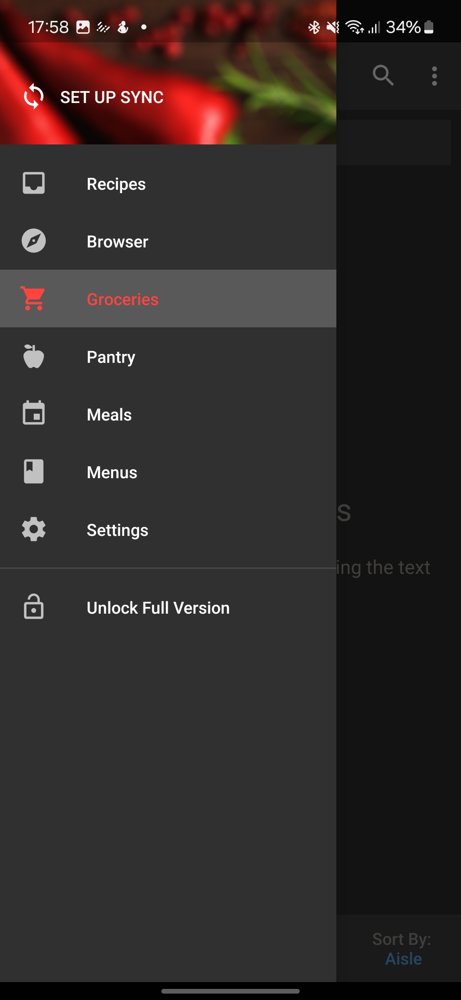
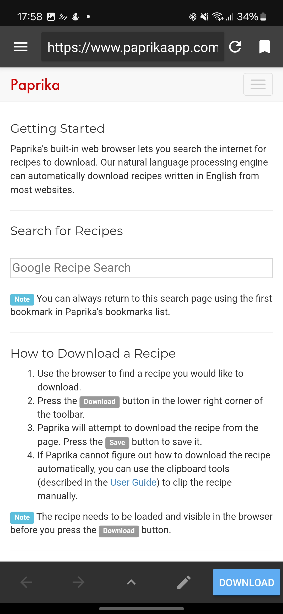
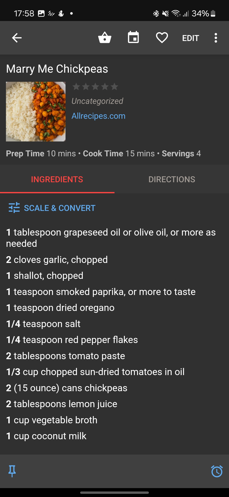

# Competitor Analysis: [Paprika] 
## General Information 
- **Name of System:** [Paprika] 
- **Company/Developer:** [Company Name] 
- **Website/Product Page:** [https://www.paprikaapp.com/] 
- **Version/Release Date:** [3.3.9] 
- **Platform(s) Supported:** [Mobile (iOS/Android), Desktop] 
- **Target Audience:** [ Pessoas que desejam reunir, organizar e acompanhar receitas digitalmente para facilitar o preparo de refeições.] 

--- 
## Core Functionality 

**Primary Purpose:** [Os principais objetivos da app é gerenciar receitas, listas de compras e planear refeicoes] 

**Key Features:** - [Organização de receitas] - [Download automatico de receitas da web] - [Lista de compras automaticas] 

**Unique Selling Points (USPs):** - [Possibilidade de aceder a web para procurar receitas e adicionalas na app facilmente] 

**Limitations/Weaknesses:** - [Dificuldade de adicionar  receitas, falta de calorias nas receitas, estetica rodimentar/Desorganizada] 

---

## Screenshots

## Online Reviews
this has changed, positively, my eating and food shopping experience. It removes so much hassle from deciding what to eat, creating a shopping list, adjusting quantities, importing recepies, stopping duplication, etc. Genius ! I Hope the people behind it are really proud of it. And I love that fact it's one off fee to have 50+ recipies and not a subscription. I have been telling everyone i know how great it is. Only thing I'd like is a batch cooking option for the meal planner. Joanna Hobbs 31/12/2024.