[Back to main Logbook Page](../hci_logbook.md)

---
# Low Fidelity Prototype and Evaluation

## D.1. Low Fidelity Prototype
    
    
O protótipo de baixa fidelidade foi criado para testar o fluxo principal da NutriChef, recolher opiniões sobre navegação e validar se as funcionalidades principais (planeamento de refeições, gestão de ingredientes e monitorização de macros) correspondem às necessidades identificadas nos Stages 0, 1 e 2.

### Ferramentas Utilizadas

Produzimos esboços em papel (ver imagens em anexo) recorrendo papeis recortados em formato de telemóvel. Esta abordagem permitiu iterações rápidas e uma observação mais natural da interacção.

### Principais Ecrãs Incluídos

| # | Descrição                                                                                                   | Ficheiro/imagem                      |
| - | ----------------------------------------------------------------------------------------------------------- | ------------------------------------ |
| 1 | **Ecrã de objectivo inicial** – pergunta ao utilizador se pretende perder peso, manter peso ou ganhar peso. |      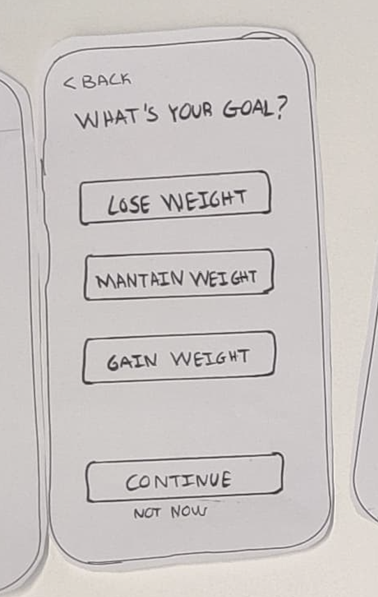      |
| 2 | **Preferências alimentares** – selecção de dietas e restrições.                                             | 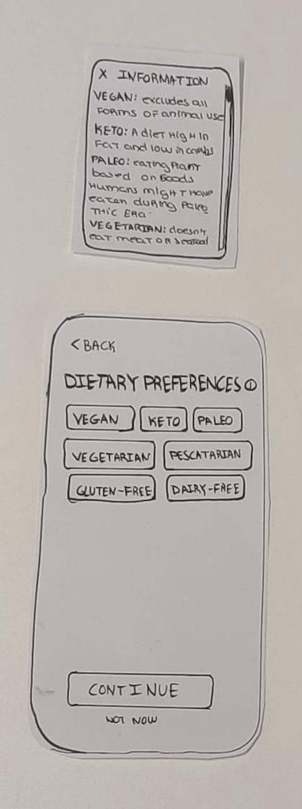         |
| 3 | **Gestão de alergias** – adicionar alergias.                                                                |   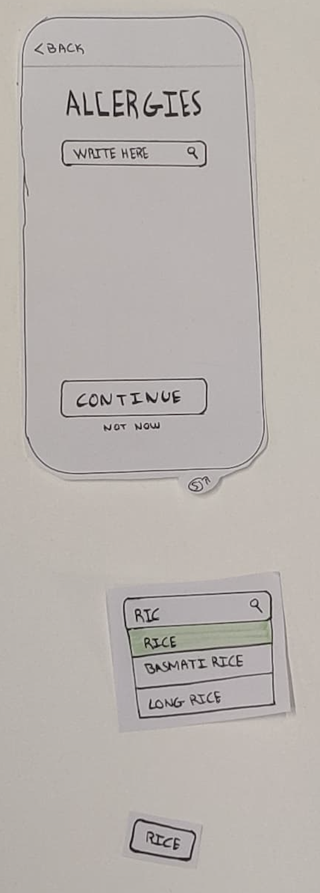      |
| 4 | **Definição de peso‑alvo** – campo livre com número de semanas em que quer perder um certo peso (sustentávelmente).                                             | 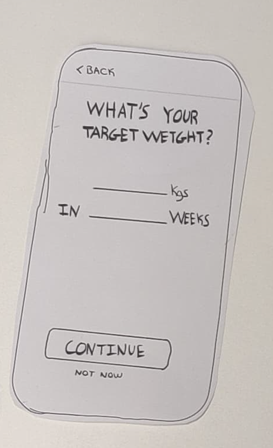          |
| 5 | **Menu Semanal** –  refeições planeadas.                               | 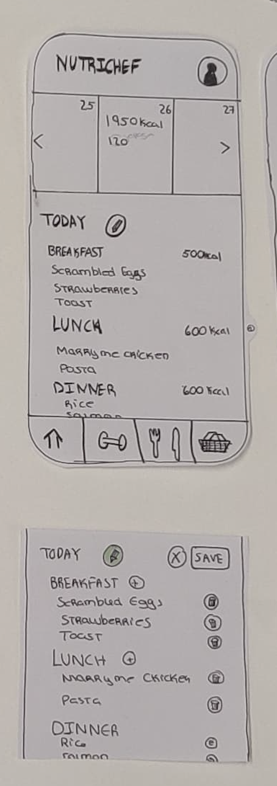        |
| 6 | **Página de receitas** – seleccionar tipo de refeição, pesquisar receita existente ou criar nova.           | 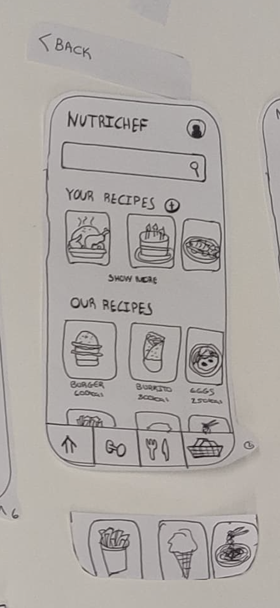  |
| 7 | **Pagina Tracking** – página onde irá aparecer ifnormção sobre calorias consumidas no dia, macros e gráficos de progresso.                        | 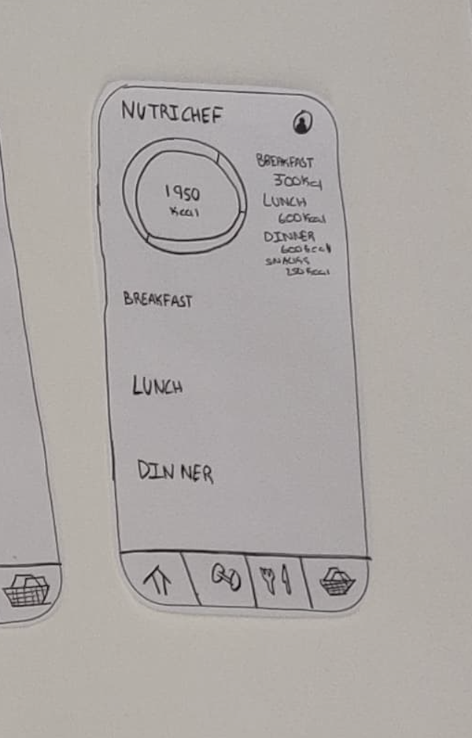    |
| 8 | **Pagina de receita individual** – página com ingredintes, passo-a-passo da receita escolhida.                                           | 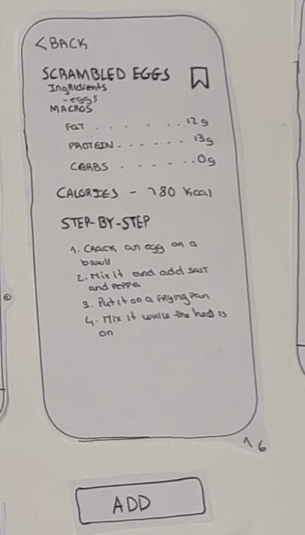              |
| 9 | **Perfil** – informações do user e onde as pode mudar.                                           | 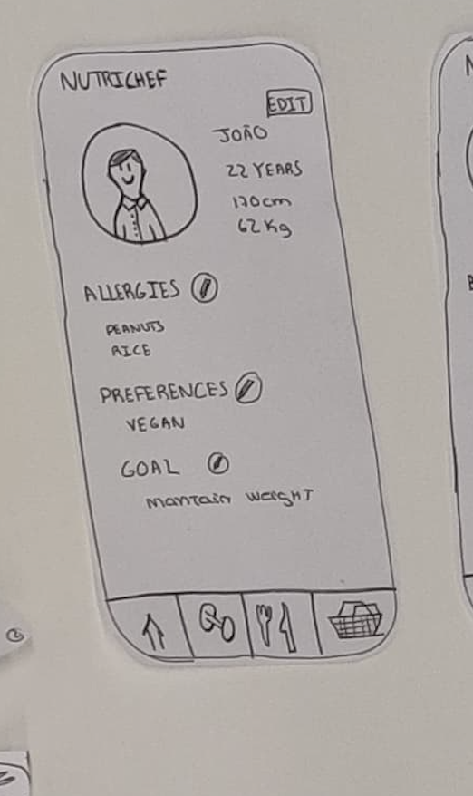              |
| 10 | **Peso atual** – peso atual, altura e se quiser percentagem de gordura para o uiser inserir.                                          | 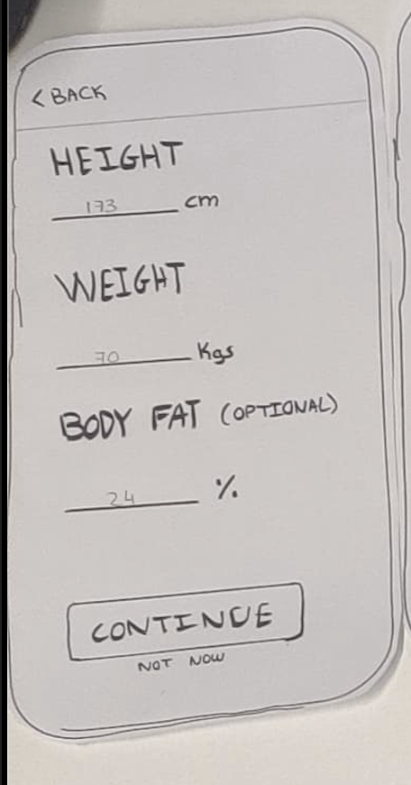              |

## D.2. Prototype Evaluation

### Método

Realizámos uma avaliação  com 4 participantes que correspondem às nossas *Personas* (Sónia e Alexandre) e dois utilizadores neutros. Cada participante executou 5 tarefas e ao fim foram entrevistados para sabermos como foi a sua experiência e que podia ser melhorado.

### Tarefas Testadas

1. **Fazer Log-in na conta**

   * Definir objectivo ("Perder peso"), peso‑alvo e número de semanas.
   * Escolher preferência (deixámos à escolha do _user_, uma vez que pretendiamos testar se usvam o botão de informação).

- Considerámos que embora seja uma tarefa não usal e, normalmente, não tão relevante de se fazer, no contexto do nosso projeto iria influenciar e ser benéfica, devido a ser necessária para a personalização da _app_ para o _user_.

2. **Adicionar nova refeição ao dia de hoje**

   - Escolher *Almoço*.
   - Procurar receita (à escolha do utilizador) e adicionar.

3. **Verificar o número de calorias e macros consumidos no dia**

    - Clicar na aba proposta.

    -Embora seja uma tarefa simples, considerámos também uma relevante dado que estavamos em dúvida do que deveriamos colocar mais naquela aba da página e não sabiamos se era intuitivo o suficiente para os users lá irem. Então, achámos por bem testar e ver o quão intuitivo e relevante era.

4.  **Escolher uma receita para fazer para o almoço que nunca tenha feito antes**
    - Clicar na aba proposta.
    - Escolher receita.
    - Ver se está dentro do objetivo e, se sim, fazê-la.

5. **Mudar as suas alergias e colocar que é alérgico a arroz.**
   
    - Clicar no _user profile_.
    - Clicar no boão de editar.
    - Adicionar a alergia e guardar.

    -Tal como em algumas das tarefas anteriores, embora não seja uma tarefa tão usual, gostaríamos de saber caso o _user_ descubrisse que tinha uma alergia se era intuitivo como a adicioncar.

### Principais Conclusões 

1. **Icons**

   - O ícone actual de *tracking* não foi percebido (sugestão: gráfico de linhas).
   - O ícone de informação (`i`) raramente é clicado, mas acharam pertinente manter.
   - O ícone de lápis para *editar* é pouco claro.

2. **Rótulos e terminologia**

   - A opção **Normal** em preferências dietárias gera confusão, substituir por **_Without Preferences_**.
   - Botões **Not now** e **Continuar** são redundantes.
   - Botão de editar na página principal não era muito óbvio.

3. **Fluxo de interacção**

   - Vários participantes tocaram na aba *Receitas* quando pretendiam adicionar uma refeição, colocar lá um botão para tal.
   - Processo de guardar receita confuso entre botão `+` e *flag*, sugerem botão **Guardar** consistente.

4. **Funcionalidade em falta**

   - Necessário histórico navegável no *tracking* (setas) e visão semanal.
   - Opção de poder ir adicionando o peso dia a dia ou mês a mês, para um melhor acompanhamento dos objetivos.

5. **Visibilidade da informação**

   - Colocar favoritos das nossas receitas para aparecerem em primeiro lugar nas minhas receitas
   - Pop up/notificação a relembrar para se pesarem, perguntar como está a evolução e etc. 
   - Colocar dois botões de **Salvar receita** em cada página de receita, embora redundante garante sempre que os _users_ percebam.

### Alterações Planeadas

| Problema identificado                      | Severidade | Alteração proposta                                      |
| ------------------------------------------ | ---------- | ------------------------------------------------------- |
| Ícone de tracking pouco intuitivo          | Alta       | Substituir por ícone de gráfico de linhas               |
| Rótulo «Normal» nas dietas                 | Média      | Mudar para «Sem preferências»                           |
| Ícone do lápis não clicados  | Média      | Adicionar legendas «Editar» abaixo dos ícones    |
| Confusão '+' vs *flag* ao guardar receitas | Alta       | Eliminar *flag*, usar botão **SAVE** único e visível |
| Página inicial pouco óbvia                 | Média      | Acrescentar breve onboarding e destacar botão '+'       |
| Histórico de tracking inexistente          | Média      | Adicionar navegação por setas e vista semanal/mensal    |
| Botões «Not now» / «Continuar» redundantes | Baixa      | Remover **Not now** ou fundir comportamentos em certos casos.         |

---

### Próximos Passos

1. Implementar as alterações no **protótipo digital de média fidelidade** (Figma).
2. Repetir teste de usabilidade com métricas quantitativas (tempo de tarefa, nº de cliques).
3. Iniciar desenho do sistema de identidade visual (paleta, tipografia) em conformidade com o que observamos.

### Imagens Extra

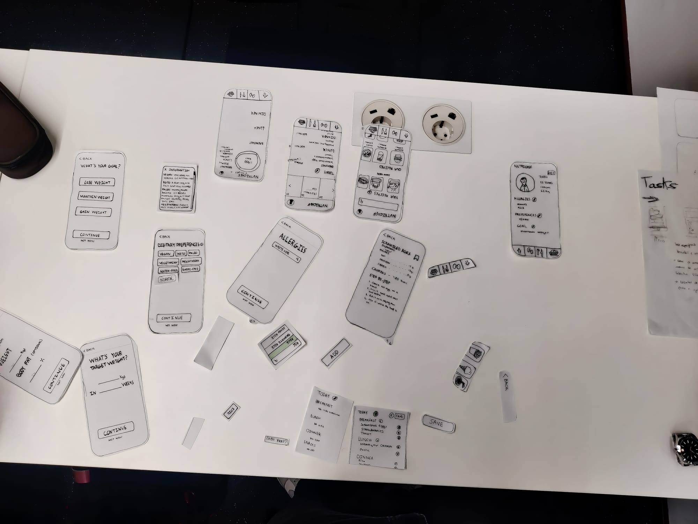
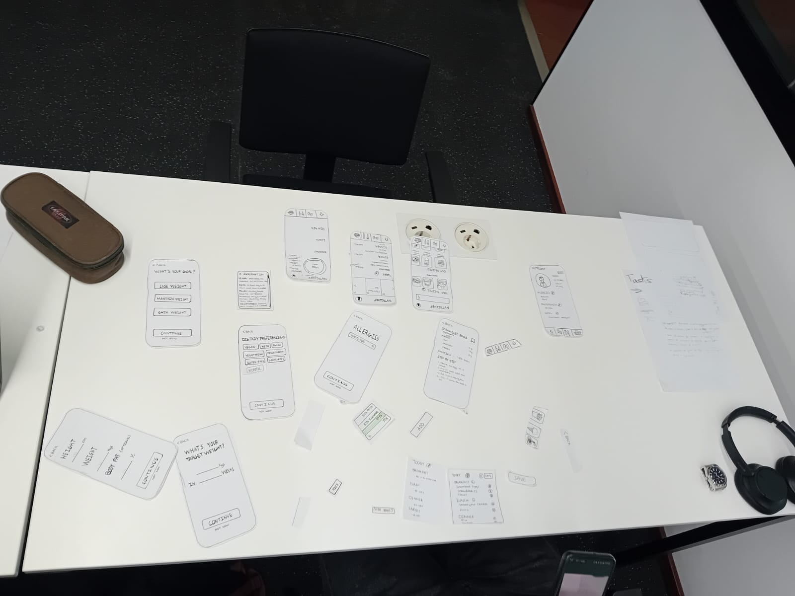
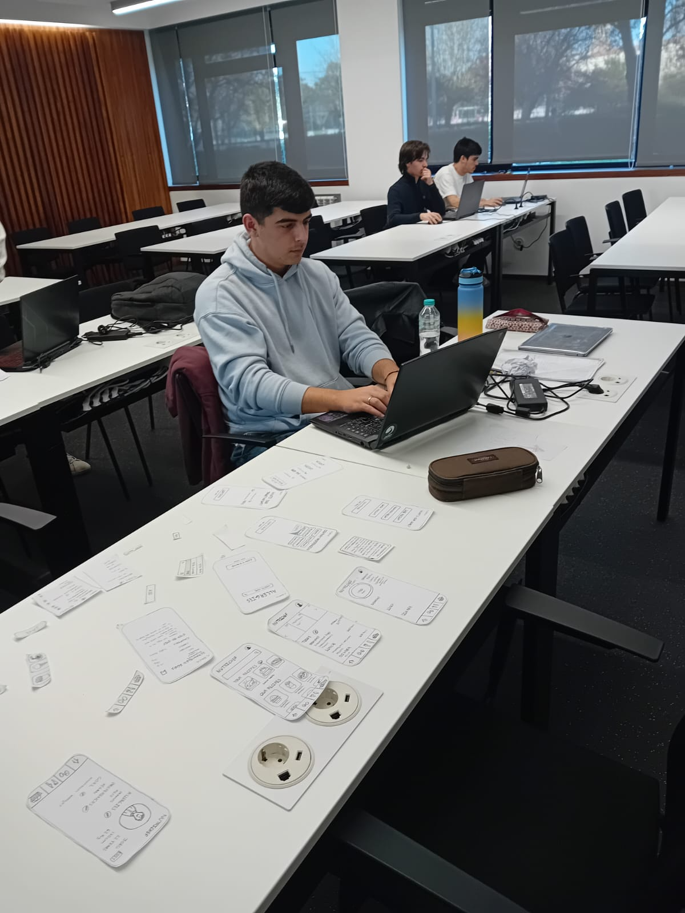
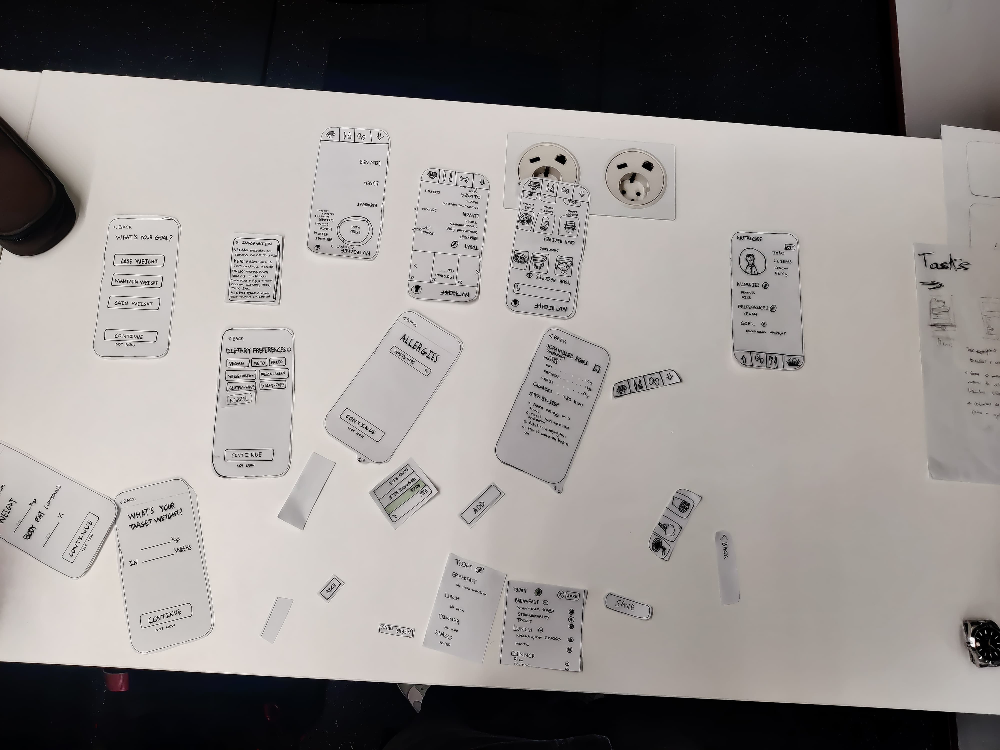

---
[Back to main Logbook Page](../hci_logbook.md)

