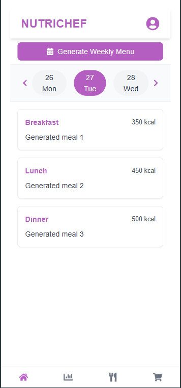
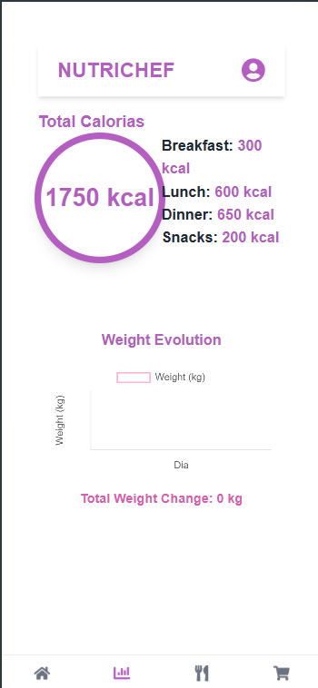
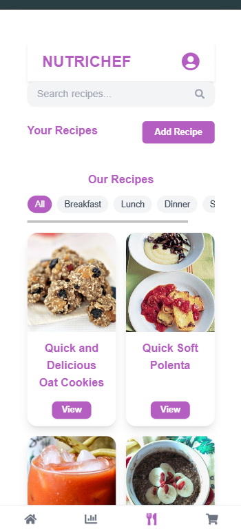
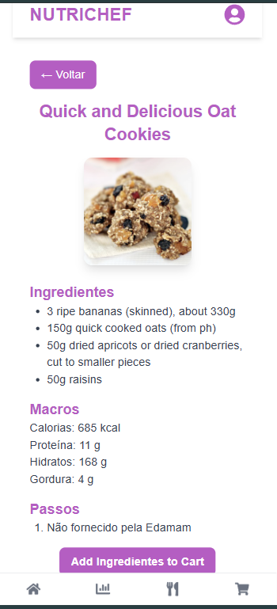
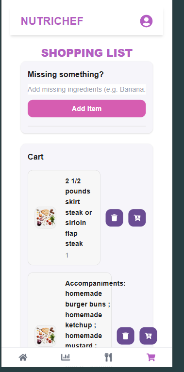
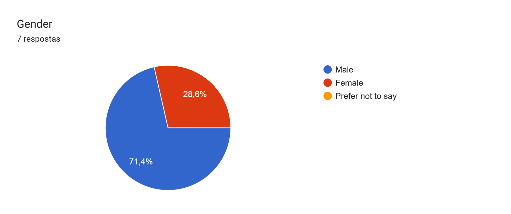
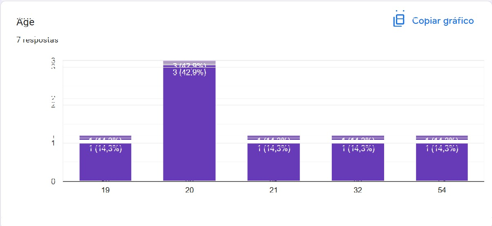

[Back to main Logbook Page](../hci_logbook.md)

---

## Functional Prototype and Evaluation

### Prototype

A versão funcional da aplicação NutriChef foi implementada com recurso ao framework React e TailwindCSS, utilizando localStorage para persistência de dados e integrando uma API externa para obtenção de receitas. As principais funcionalidades implementadas incluem registo e login de utilizadores, configuração inicial (preferências alimentares, objetivos, dados físicos), gestão de receitas personalizadas, planeamento alimentar semanal, visualização de estatísticas e lista de compras interativa.

Prints of the app:

Main page:

Stats Page:

Recipe page:

Recipe details page:

Shopping list page:

### User Evaluation

**Task 1: Criar conta, dar login e responder às perguntas iniciais**

* Todos os utilizadores conseguiram executar esta tarefa com sucesso, sem qualquer dificuldade assinalada.

**Task 2: Verificar as calorias consumidas no dia**

* A tarefa foi realizada com sucesso. No entanto, foi sugerido utilizar um ícone diferente para representar a secção de estatísticas, de forma a melhorar a clareza e usabilidade da interface.

**Task 3: Adicionar os ingredientes da receita "Peas and Lettuce" ao carrinho de compras**

* Foi identificado um erro ao tentar adicionar mais do que uma receita ao carrinho — apenas a primeira receita era adicionada. Este erro já foi corrigido.

**Task 4: Descobrir calorias da receita "Mediterranean Chicken with Soft Polenta"**

* Os utilizadores não apresentaram dificuldades em aceder aos detalhes das receitas, conseguindo visualizar as informações nutricionais de forma intuitiva.

**Task 5: Editar o perfil para altura de 150cm, 82kg, nome "André" e idade 22**

* A tarefa foi completada com êxito por todos os participantes, sem dificuldades reportadas.

**Task 6: Ir para o dia 30**

* Vários utilizadores tentaram clicar diretamente na célula do dia seguinte, em vez de usarem a seta de navegação. Sugere-se, portanto, permitir a navegação direta entre dias ao clicar nas células. Foi também identificado um erro visual: ao avançar vários dias, o indicador gráfico do dia atual diminuía de tamanho de forma inesperada, afetando a legibilidade.

**Task 7: Gerar o menu semanal**

* Todos os utilizadores realizaram a tarefa sem dificuldades, mas verificou-se que não existia ainda uma ação visível associada ao botão. A funcionalidade estava planeada, mas não completamente implementada à data da avaliação.

### Observações e Sugestões

Durante a avaliação, os utilizadores foram encorajados a explorar livremente a aplicação. Algumas sugestões espontâneas incluíram:

* Permitir adicionar ingredientes ou receitas ao menu semanal a partir de diferentes páginas (ex: Recipe Details).
* Após criar conta, o utilizador deve ser redirecionado diretamente para a aplicação, sem voltar ao ecrã de login.
* Corrigir o erro em que o nome apresentado no perfil era o username e não o nome real introduzido.

### Limitações Identificadas

A principal limitação técnica prende-se com a utilização da API Edamam. Devido ao modelo da API usado ser o gratuito, não foi possível obter detalhes completos sobre os ingredientes de várias receitas, passos sem ser em links, geração de menu personalizada e ingredientes como um só. Esta limitação afetou diretamente a experiência na secção do carrinho de compras e obrigou a equipa a contornar o problema com simplificações no design e nos dados apresentados.

Statistics:

Gender:

Age:

I think  that I would like to use this system frequently:

I found the system unnecessarily complex:

I thouth the system was easy to use:

I think that I would need the support of a technical person to be able to use this system:

I found the various functions in this system were well integrated:

I thought there was too much inconsistency in the system:

I would imagine that most people would learn to use this system very quickly:

I found the system very cumbersome to use:

I felt very condient uding the system:

I need to learn a lot of things before I could get going with this system:

---

[Back to main Logbook Page](../hci_logbook.md)

---
